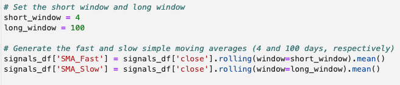
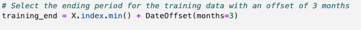
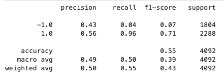
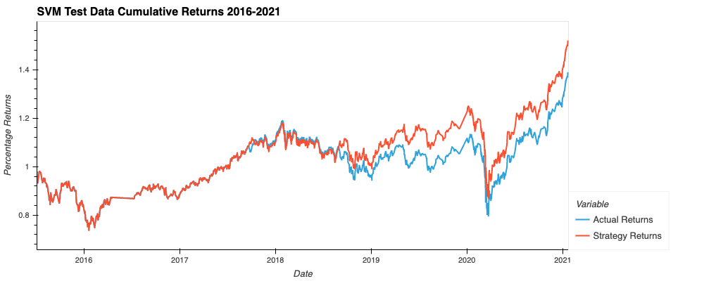
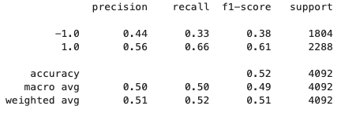
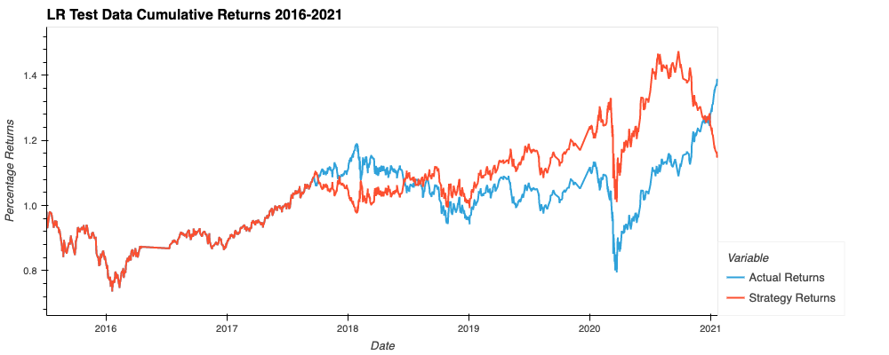
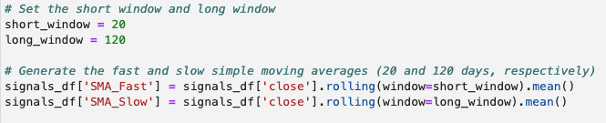
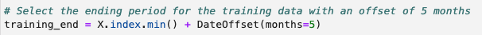
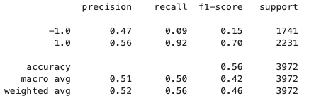
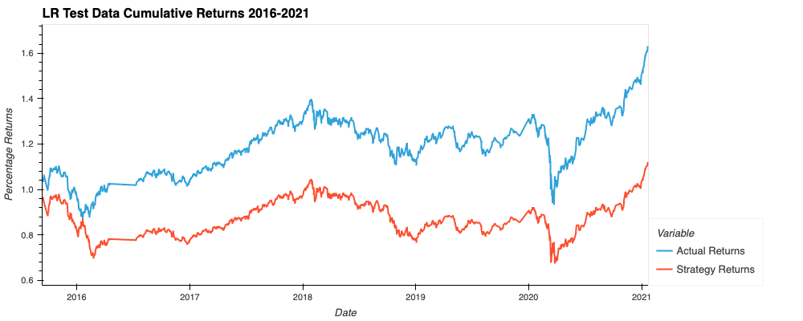

# Machine_Learning_Trading_Bot (README.md & Report)

This is a Jupyter Lab notebook file. This `.ipynb` file utilizes Python to read a `.csv` file. This code backtests a machine learning algorithm, through scikit-learn, in order to determine whether the algorithim is strong enough to give accurate predictions for future outcomes. A data analyst will need to know ahead of time what accuracy margins their company deems acceptable. 

---

## REPORT

In the below screenshot, you can see that we began with a baseline short rolling window of 4 units and a long rolling window of 100 units.



In the below screenshot, you can see that we began with a baseline date offset of 3 months.



In the below screenshot, you can see our baseline testing report which uses scikit-learn's support vector machine (SVM) machine learning method. This report uses scaled data (by `StandardScaler`) and has an accuracy rating of 55%. Now that we have this baseline, we will continue testing to see if we can get a more accurate prediction model.



In the below screenshot, you can see a plot of the actual historical returns for the given dates along with the predicted returns from our algorithm using the SVM method. You can see that the model (red line) was more accurate in the earlier months and slowly became less and less accurate. However, the model is still on track with the returns, just overestimating the percentage returns by about 0.15%.



In the below screenshot, you can see our baseline testing report which uses scikit-learn's logistic regression (LR) machine learning method. This report uses scaled data (by `StandardScaler`) and has an accuracy rating of 52%. Using the same baseline scaled testing data as above, we can see that the SVM method performed better.



In the below screenshot, you can see a plot of the actual historical returns for the given dates along with the predicted returns from our algorithm using the LR method. You can see that the model (red line) was more accurate in the earlier months and slowly became less and less accurate. You can clearly see from late 2017 to mid 2018 that the model was inverse from the actual returns and then again at the beginning of 2021 it seems to be moving inverse again. From the plot we can see that this model is not on track with the actual returns. This is not a model I would recommend. Let's see if we can adjust the rolling windows and/or the date offset to get better results.



In the below screenshot, we changed the short rolling window to 20 units and the long rolling window to 120 units.



In the below screenshot, we changed the date offset to 5 months. I tried about 15 different combinations, defintely not all the possiblities, and found that a short rolling window of 20 units, a long rolling window of 120 units, and a date offset of 5 months afforded the best outcome. 



In the below screenshot, you can see our tuned testing report which uses scikit-learn's logistic regression (LR) machine learning method. This report uses scaled data (by `StandardScaler`) and has an accuracy rating of 56%. This is better than our original accuracy rating of 52%, however it's still not great. Given more time, we could continue to tweak tihs algorithm in hopes of getting a higher rating. 56%, while not amazing, is better than the baseline report for either the SVM (55%) or the LR (52%).



In the below screenshot, you can see that the new LR model (red line) is moving more on track with the actual returns. The lines seem to match each other. However, the predictions are still higher than the actual returns by about 0.2-0.3%.



The next steps would be to work with the rolling windows and the date offset in attempts to get a more accurate prediction that doesn't overestimate the equity's returns.

--

## Technologies

Please be sure you have Jupyter Lab installed:

* [JupyterLab](https://jupyter.org/)

This application was written in Python 3.9.12. This application is dependent on the following libraries:

* [pandas](https://pandas.pydata.org/)
* [numpy](https://numpy.org/)
* [pathlib](https://docs.python.org/3/library/pathlib.html)
* [hvplot](https://hvplot.holoviz.org/)
* [matplotlib](https://matplotlib.org/)
* [sklearn svm](https://scikit-learn.org/stable/modules/generated/sklearn.svm.SVC.html)
* [sklearn preprocessing standard scaler](https://scikit-learn.org/stable/modules/generated/sklearn.preprocessing.StandardScaler.html)
* [pandas tseries offsets date offset](https://pandas.pydata.org/docs/reference/api/pandas.tseries.offsets.DateOffset.html)
* [sklearn metrics classification report](https://scikit-learn.org/stable/modules/generated/sklearn.metrics.classification_report.html)
* [sklearn linear model logistic regression](https://scikit-learn.org/stable/modules/generated/sklearn.linear_model.LogisticRegression.html)

---

## Installation Guide

If you have [Anaconda](https://www.anaconda.com/products/distribution) downloaded, then pandas and matplotlib will be part of your package. You can check that they're ready to use by typing the following in your CLI terminal:

```python
conda list pandas
conda list numpy
conda list pathlib
conda list hvplot
conda list matplotlib

```

You can download the following local machine using this code:
```python
pip install -U scikit-learn
```

And check that they've been installed with this code:
```python
conda list scikit-learn
```

---

## Usage

Open your CLI terminal and type
```python
jupyter lab
```
then JupyterLab will automatically open in your browswer. Use the left side menu bar to search for the `machine_learning_trading_bot.ipynb` file. Open this file. Then you can use the formaulas in the `.ipynb` file to analyze the data your `.csv` file(s) and optimize the algorithm to make preditions based on your data. You can change the rolling windows and the amount of months in the algorithim to try to get the most accurate predictions possible.

---

## Contributors

[Rachel Ann Hodson](https://www.linkedin.com/in/rachelannhodson/)
rachelannhodson@gmail.com

---

## License

MIT